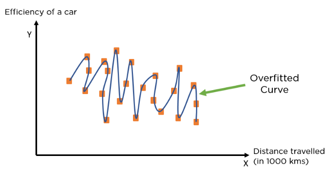
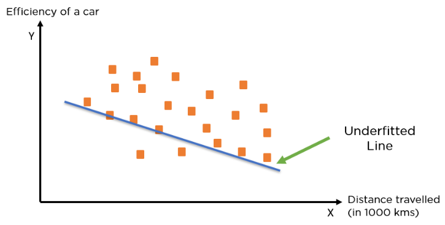

# What is Machine Learning?
Layman:
```
    Machine Learning can be defined as the ability of a machine to learn something without having to be programmed for that specific thing.
    
    computers use a massive set of data and apply algorithms for ‘training’ themselves and making predictions.
```
Def:
```
    Machine learning is a subset of Artificial Intelligence that comprises algorithms programmed to gather information without explicit instructions at each step.
```

Story:
```
    Machine Learning is a subset of AI where the machine is trained with a lot of data
    and that machine is used to solve some problems based on its training(prior experiences) even though the scenario is new to it.
    This is done without any explicit programming for that particular scenario.
```

# What is an Algoritm?
```Algorithm is a set of instructions```

# What is Machine Learning Algorithm??
```Machine Learning algorithm are sets of instructions that the model follows to return an acceptable result```

# What is Supervised Machine Learning?
```
    Supervised learning is the type of machine learning in which 
    machines are trained using well "labelled" training data. --> Training require more computation time.
```
# What is Unsupervised Machine Learning?
```
    Unsupervised learning is a type of machine learning in which 
    models are trained using unlabeled dataset
```
# What is Parametric Model?
```

```
# What is Non-Parametric Model?
```

```
# What is Bias and Variance?
```
Bias:
    Assumptions made by a model to make a function easier to learn.
     
    * It is actually the error rate of the training data. 
    * When the error rate has a high value, we call it High Bias and 
      when the error rate has a low value, we call it low Bias.
    
Variance:  
    * The difference between the error rate of training data and testing data is called variance. 
    * If the difference is high then it’s called high variance and 
      when the difference of errors is low then it’s called low variance. 
```
# What is OverFitting?
```
A model is said to be overfitted when it performs very well for training data but has poor performance with test data.

In this case, the machine learning model learns the details and noise in the training data such that it negatively affects the performance of the model on test data.
```

Reasons for Overfitting are as follows:
```
    1.The model has High variance and low bias
    2.The model is too complex
    
    3.The size of the training dataset used is not enough
    4.Data used for training is not cleaned and contains noise (garbage values) in it 
```
Techniques to reduce overfitting:

```
    1.Increase training data.
    Removing features(Reducing Noise in data)
    2.Ridge Regularization and Lasso Regularization
    3.Using K-fold cross-validation
    4.Ensembling
    5.Use dropout for neural networks to tackle overfitting.
```
# What is UnderFitting?
```
When a model has not learned the patterns in the training data well and is unable to generalize well on the new data, it is known as underfitting. 
An underfit model has poor performance on the training data and will result in unreliable predictions.
Underfitting occurs due to high bias and low variance.
```


Reasons for Underfitting:
```
* The model has a high bias
The model is too simple

* The size of the training dataset used is not enough
Data used for training is not cleaned and contains noise (garbage values) in it ==> Noise is unnecessary and irrelevant data that reduces the performance of the model.
```
Ways to Tackle Underfitting:
```
* Increase the number of features in the dataset
* Increase the duration of training the data

Increase model complexity
Reduce noise in the data
```
