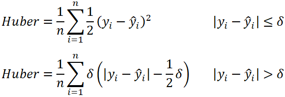
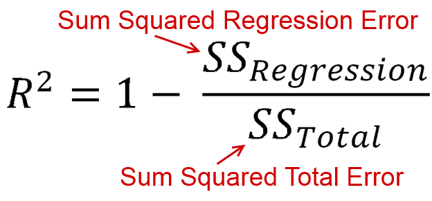
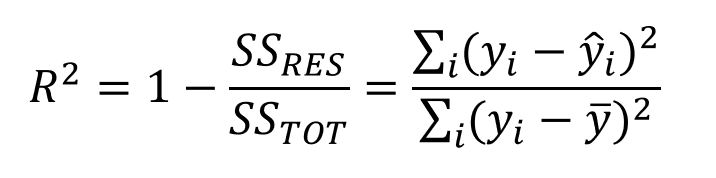
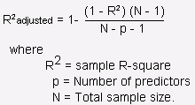

# What is Regression? ==> Def:
```
Regression is a statistical method used to determine 
    the strength and character of the relationship between one dependent variable and a series of  independent variables.
```
# What is simple Linear Regression?
```

```
# What is Multiple Linear Regression?
```

```


---
# What is Linear Regression? ==> Complete Story
```
Linear regression is Supervised ML Algorithm which is used to predict dependant variale based on one or more independant variable.
The prediction is done based on the best fit line

initially all the slopes and intercepts are initialized to one.
The Cost Function can be MSE, MAE, HuberLoss.    
Now the slopes and intercept values get updated using gradient descent concept till convergence (till we reach global minima or minimum cost function.)
Based on hyper parameter (learninng rate) the spped of convergence may vary.

if CF = MSE:
    The CF is differentiable and  it is a convex function and has one globa and one local minima.
    However it is not robust to outliers.
if CF = MAE:
    It is robbust to ourliers but it takes more time to converge.
    
So we use hubber loss as cost function to overcome these disadvantages.
    This huber loss is combination of MSE and MAE 
    It has hyperparamete delta.
```
<p align="center">
  
</p>

# Performance Metrics:
R_SQUARE:
```
* R-squared is a statistical measure of how close the data are to the fitted regression line. It is also
known as the coefficient of determination.

* R-squared = Explained variation / Total variation
* R-squared is always between 0 and 100%.
* The higher the R-squared, the better the model fits your data.
```
<p align="center">
  
</p>
<p align="center">
  
</p>


Adjusted_R_SQUARE :
```
* Even if we add independent variables which are not meaningful**, it will improve R-Square
value.
* we use adjusted R-Square to measure equivalent RSquare,which penalizes our model with any junk independent variable.
```
<p align="center">
  
</p>
